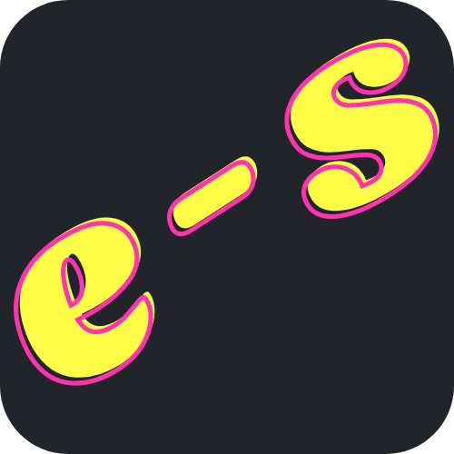

  

<!-- PROJECT LOGO -->
<br />
<div align="center">
  <a href="https://e-shop-gaurav.surge.sh">
    
  </a>
  
  <h3 align="center"><b>E SHOP</b></h3>

  <p align="center">
    This project is a final assignment for the frontend certification of Full Stack Development
    courese on Internshala. This project is based on bootstrap 5, HTML/CSS/JS, etc. Copying for you internshala assignment is not recommended but inspiration.
    <br />
    <a href="#"><strong>Explore the docs »</strong></a>
    <br />
    <br />
    <a href="https://e-shop-gaurav.surge.sh"
     style="color:orange; font-weight:bold">Visist now!!</a>
    ·
    <a href="https://github.com/gv211432/Internshala_FSDCapstone/issues">Report Bug</a>
    ·
    <a href="https://github.com/gv211432/Internshala_FSDCapstone/issues">Request Feature</a>
  </p>
</div>

<!-- ABOUT THE PROJECT -->

## ☑️ About The Project

<br>


<br>

This project requires the bootstrap5 and HTML/CSS/JS knowledge. This is hosted on surge server.
There are components of all functional units present on the site. Project flow is like reactjs, however using element ids for injecting extra nodes.

It is a fully responsive site and supports all display sizes.

This project is developed by [me](https://github.com/gv211432).


<br>
<br>

## ⚙️ Installation

### 1. Clone this repository

```js
git clone https://github.com/gv211432/Internshala_FSDCapstone.git
```

### 2. Open the directory `Internshala_FSDCapstone`

```
cd Internshala_FSDCapstone
```

### 3. More screenshots
<br>
<br>


<p align="right">(<a href="#top">back to top</a>)</p>

## 📖 License

Licence details are given here.
[MIT](https://github.com/gv211432/Internshala_FSDCapstone/blob/main/LICENSE)
